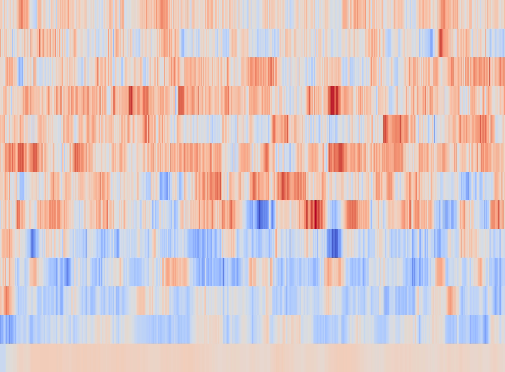

음성 신호 분석
==============
주제 선정 배경
--------------
인공지능 스피커, 음성 비서 등 음성 인식 기술을 활용한 인공지능 산업이 싹트고 있다. 음성 인식을 활용하는 인공지능 서비스는 특성상 연락처, 
메신저 등 사용자의 개인 데이터에 접근하는 경우가 많은데 타인이 서비스를 사용하는 경우 보안 이슈가 발생할수 있다. 따라서 음성이 사용자의
음성인지, 타인의 음성인지 구별하는 머신러닝 분류 모델이 필요하다. 본 연구는 1. 최고의 분류 성능을 나타내는 머신러닝 모델을 찾는 연구와
2. 머신러닝 모델에 통계적 방법을 앙상블하여 유의미한 성능 개선이 있는지 확인하는 연구로 진행된다.

데이터
--------------
서울말 낭독체 발화 말뭉치 공개데이터를 사용한다. 해당 데이터는 20대 남/여, 30대 남, 40대 여, 50대 남/여 등 6개 카테고리, 87,049개 문장으로
이루어져 있으며 파일 확장자는 .wav이다. 발화자는 20대 여성 20명, 20대 남성 20명, 30대 남성 20명, 40대 여성 20명, 50대/60대 여성 19명,
50대/60대 남성 20명 등 119명이다.

# 1. 데이터 전처리
.wav 파일은 시간에 따른 음압의 크기를 저장한 1차원 벡터이며 푸리에 변환을 이용해 이를 보다 유용한 시간에 따른 주파수 대역으로 변환할 수 있다.
음성 입력과 푸리에 변환에는 파이썬의 librosa 패키지를 사용했으며 시간에 따라 20개 주파수별로 세기를 나타낸 MFCC 벡터를 생성했다.

가로축은 시간, 세로축은 주파수 대역을 나타낸 것이다. 낮은 주파수 대역의 음압이 낮고(파란색) 높은 주파수 대역의 음압이 높은 것을(빨간색)
확인할 수 있다. 읽기 오류가 발생한 4개의 파일을 제외하고 87,045개 파일의 MFCC 벡터에서 음압이 미약한 0번 인덱스를 제거하고 주파수 대역별로
평균값을 생성했다. 생성한 데이터의 크기는 (87045, 19)이며  pickle 모듈을 사용해 .pkl 파일로 저장했다.

# 2. 머신러닝 모델 생성
생성한 데이터를 훈련용 데이터셋 70%, 시험용 데이터셋 30%로 분할했다. 머신러닝 모델은 scikit-learn의 로지스틱 회귀, 랜덤 포레스트, SVM 모듈을
사용했다. 
