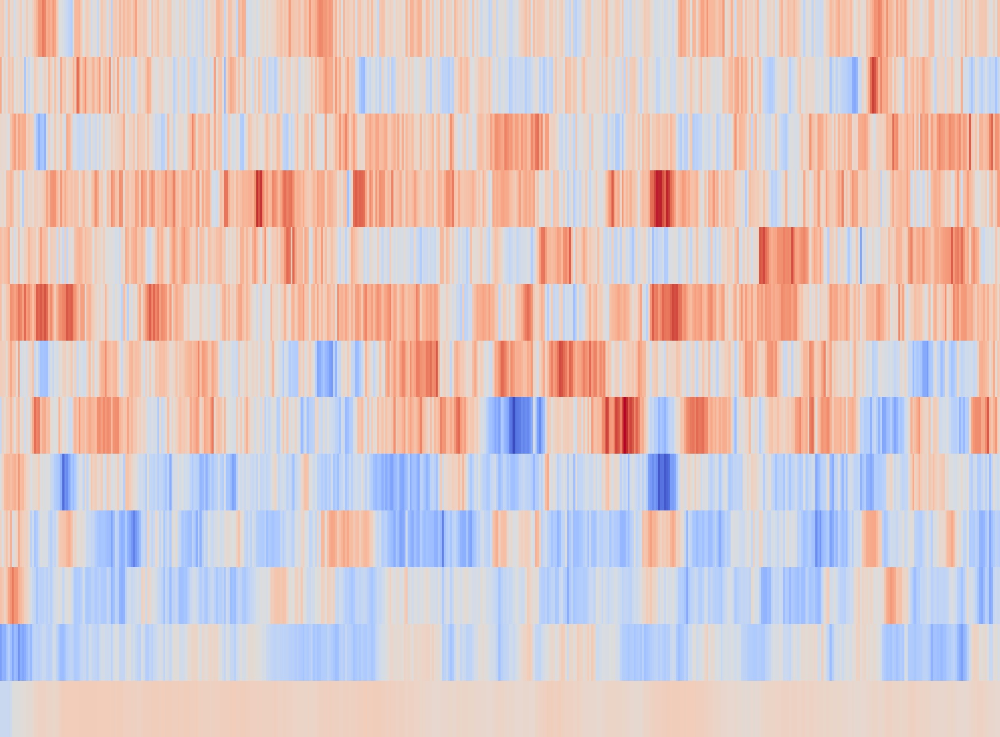
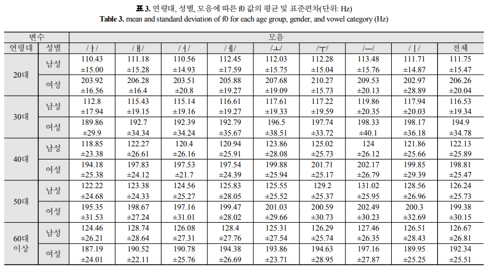
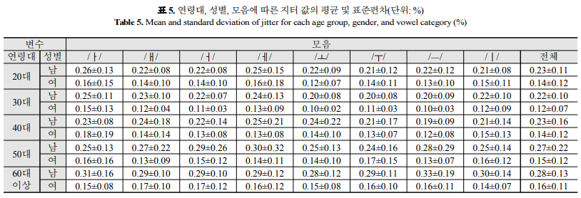
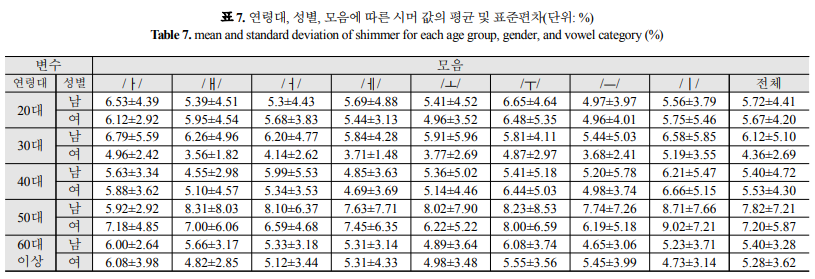
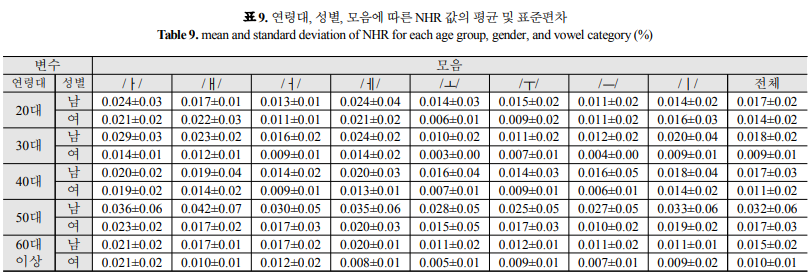

음성 신호 분석을 통한 성별, 연령대 분류
==============
주제 선정 배경
--------------
인공지능 스피커, 음성 비서 등 음성 인식 기술을 활용한 인공지능 산업이 싹트고 있다. 음성 인식을 활용하는 인공지능 서비스는 특성상 연락처, 
메신저 등 사용자의 개인 데이터에 접근할 수 있는 권한을 가진 경우가 많은데 타인이 서비스를 사용하는 경우 보안 이슈가 발생할수 있다. 따라서
음성이 사용자의 음성인지, 타인의 음성인지 구별하는 머신러닝 분류 모델을 통해 보안을 강화할 필요가 있다. 본 연구는 1. 분류 성능이 가장 높은
머신러닝 모델을 찾는 연구와 2. 머신러닝 모델과 통계적 방법을 앙상블하여 유의미한 성능 개선이 있는지 확인하는 연구로 진행된다.

데이터
--------------
서울말 낭독체 발화 말뭉치 공개데이터를 사용한다. 본 데이터는 20대 남/여, 30대 남, 40대 여, 50대 남/여 등 6개 카테고리, 87,049개 문장으로
이루어져 있으며 파일 확장자는 .wav이다. 발화자 수는 20대 여성 20명, 20대 남성 20명, 30대 남성 20명, 40대 여성 20명, 50대/60대 여성 19명,
50대/60대 남성 20명 등 119명이다.

### 1. 데이터 전처리
.wav 파일은 시간에 따른 음압의 크기를 저장한 1차원 벡터이며 푸리에 변환을 통해 보다 유용한 시간에 따른 주파수 대역으로 변환할 수 있다.
음원 읽기와 푸리에 변환에는 파이썬의 librosa 패키지를 사용했으며 음원에서 비어있는 부분을 제거한 후 시간에 따라 20개 주파수 대역별로
세기를 나타낸 MFCC 벡터를 생성했다.

가로축은 시간, 세로축은 주파수 대역을 나타낸 것이다. 낮은 주파수 대역의 음압이 낮고(파란색) 높은 주파수 대역의 음압이 높은 것을(빨간색)
확인할 수 있다. 읽기 오류가 발생하는 4개의 파일을 제외한 87,045개 음원에서 MFCC 벡터를 생성하고 음압이 미약한 0번 인덱스를 제거한 뒤
주파수 대역별로 평균값을 구했다. 음원별로 (1x19) 크기의 벡터가 생성되었으며 총 데이터의 크기는 (87045, 19)이다. 생성한 데이터는 pickle
모듈을 사용해 .pkl 파일로 저장했다.

### 2. 머신러닝 모델 생성
생성한 데이터를 훈련용 데이터셋 70%, 시험용 데이터셋 30%로 분할했다. 머신러닝 모델로는 scikit-learn의 로지스틱 회귀, 랜덤 포레스트, SVM
모듈을 선정했다. 랜덤 포레스트는 분류 성능과 연산 시간을 고려하여 T=50, D=15로 설정했다. 훈련한 모델로 시험용 데이터셋의 카테고리를 예측한
결과를 실제 라벨과 비교했을 때의 정확도와 혼동 행렬은 다음과 같다(행: 실제, 열: 예측).

1. 로지스틱 회귀(Accuracy: 0.7554)  

|     |  20F  |  20M  |  30M  |  40F  |  50F  |  50M  |
| --- |  ---: |  ---: |  ---: |  ---: |  ---: |  ---: |
| 20F | 5002  |   55  |   14  |  406  |  124  |   28  |
| 20M |   78  | 3970  |  630  |   27  |   18  |  247  |
| 30M |   10  |  577  | 4180  |    4  |   11  |  417  |
| 40F |  478  |   61  |   31  | 4456  |  447  |   73  |
| 50F |  306  |   18  |   79  | 1087  |  758  |   70  |
| 50M |   53  |  417  |  455  |  121  |   46  | 1360  |  
  

2. 랜덤 포레스트(Accuracy: 0.9595)

|     |  20F  |  20M  |  30M  |  40F  |  50F  |  50M  |
| --- |  ---: |  ---: |  ---: |  ---: |  ---: |  ---: |
| 20F | 5497  |   34  |    8  |   77  |   10  |    3  |
| 20M |   11  | 4866  |   58  |    5  |    2  |   28  |
| 30M |    1  |   67  | 5104  |    2  |    1  |   24  |
| 40F |  136  |   17  |    9  | 5356  |   23  |    5  |
| 50F |  118  |   19  |    3  |  229  | 1944  |    5  |
| 50M |   16  |   58  |   70  |    8  |   11  | 2289  |  
  

3. SVM(Accuracy: 0.8923)

|     |  20F  |  20M  |  30M  |  40F  |  50F  |  50M  |
| --- |  ---: |  ---: |  ---: |  ---: |  ---: |  ---: |
| 20F | 5327  |   14  |    3  |  215  |   64  |    6  |
| 20M |   18  | 4711  |  155  |    2  |    6  |   78  |
| 30M |    1  |  183  | 4935  |    4  |    2  |   74  |
| 40F |  326  |   33  |    9  | 5094  |   77  |    7  |
| 50F |  294  |   18  |    4  |  728  | 1256  |   18  |
| 50M |   34  |  127  |  243  |   42  |   27  | 1979  |  
  
랜덤 포레스트 모델의 분류 성능이 가장 뛰어난 것을 확인할 수 있다.

### 3. 하이퍼 파라미터 조정
랜덤 포레스트는 생성하는 의사결정 나무의 수 T와 나무의 깊이 D에 따라 모델의 성능이 달라진다. T는 클수록 분류 성능이 좋아지지만 모델 생성
시간이 길어지고, D는 작으면 과소적합, 크면 과대적합의 위험이 있다. 따라서 분류 성능과 연산 시간을 고려한 적절한 파라미터 값을 찾는 것이
중요하다. T와 D에 따른 랜덤 포레스트 모델의 분류 성능은 다음과 같다. 표의 값은 각 T와 D에 대해 랜덤 포레스트 모델링을 50회 반복하여 평균
정확도를 구한 것이다.  

(행: T, 열: D, 값: Accuracy)
|     |      2    |      3    |      5    |      7    |     10    |     13    |     16    |     20    |     25    |     30    |
| --- |    ---:   |    ---:   |    ---:   |    ---:   |    ---:   |    ---:   |    ---:   |    ---:   |    ---:   |    ---:   |
|  10 |   0.5681  |   0.6256  |   0.7316  |   0.8257  |   0.9037  |   0.9342  |   0.9446  |   0.9472  | **0.9473**|   0.9472  |
|  20 |   0.5812  |   0.6374  |   0.7428  |   0.8394  |   0.9140  |   0.9438  |   0.9554  |   0.9589  | **0.9595**|   0.9592  |
|  30 |   0.5873  |   0.6443  |   0.7468  |   0.8439  |   0.9169  |   0.9470  |   0.9585  |   0.9627  | **0.9633**|   0.9630  |
|  40 |   0.5884  |   0.6464  |   0.7513  |   0.8472  |   0.9187  |   0.9489  |   0.9603  |   0.9645  | **0.9653**|   0.9651  |
|  50 |   0.5911  |   0.6460  |   0.7519  |   0.8481  |   0.9200  |   0.9496  |   0.9613  |   0.9656  | **0.9666**|   0.9664  |
|  60 |   0.5919  |   0.6529  |   0.7517  |   0.8495  |   0.9208  |   0.9502  |   0.9617  |   0.9662  | **0.9672**| **0.9672**|
|  70 |   0.5912  |   0.6505  |   0.7524  |   0.8502  |   0.9207  |   0.9506  |   0.9624  |   0.9669  | **0.9677**|   0.9675  |
|  80 |   0.5975  |   0.6506  |   0.7537  |   0.8507  |   0.9214  |   0.9509  |   0.9626  |   0.9671  | **0.9682**|   0.9681  |
|  90 |   0.5962  |   0.6527  |   0.7535  |   0.8509  |   0.9216  |   0.9514  |   0.9631  |   0.9674  |   0.9684  | **0.9685**|
| 100 |   0.5963  |   0.6528  |   0.7544  |   0.8513  |   0.9218  |   0.9516  |   0.9632  |   0.9676  | **0.9687**|   0.9686  |  

T=100, D=25일 때 분류 성능이 가장 뛰어난 것을 확인할 수 있다.
T가 커질수록 성능이 향상된다는 점에서 T>100인 경우 더 좋은 분류 성능을 보일 것이라고 추측할 수 있다. T=1000, D=25로 설정하고 분류 모델을
생성한 결과는 다음과 같다.

랜덤 포레스트 - T=1000, D=25 (Accuracy: 0.9708)

|     |  20F  |  20M  |  30M  |  40F  |  50F  |  50M  |
| --- |  ---: |  ---: |  ---: |  ---: |  ---: |  ---: |
| 20F | 5541  |   24  |    7  |   46  |    9  |    2  |
| 20M |   11  | 4872  |   55  |    3  |    4  |   25  |
| 30M |    0  |   39  | 5137  |    2  |    0  |   21  |
| 40F |  105  |   12  |   10  | 5396  |   21  |    2  |
| 50F |   79  |   16  |    3  |  143  | 2074  |    3  |
| 50M |   14  |   38  |   53  |    8  |    7  | 2332  |  

T=100, D=25일 때보다 정확도는 0.0019 상승했지만 연산 시간도 T와 비례하여 증가했으며 100T당 약 42초가 소요됐다. T=30이면 T=1000일 때와
비교해 99%의 정확도를 보이므로, 분류 성능과 연산 시간을 고려했을 때 T=30, D=25면 충분한 분류 성능을 낼 수 있다.

### 4. 통계적 분류 모델
통계적으로 음성의 카테고리를 분류하는 방법은 다음과 같다.

1. 음성에서 추출 가능한 다양한 특성을 조사한다.
- 음성에는 평균 진동수, 지터(jitter), 시머(shimmer), NHR 등 다양한 특성이 있다.
- 논문 조사를 통해 성별, 연령대별로 각 특성의 평균과 표준편차를 구한다.

(서윤정, 신지영. (2018). 모음 연장 발성이 보이는 연령대별 음향음성학적 특성 연구. 말소리와 음성과학, 10(4), pp. 67-76.)  
  
  
2. 음성의 각 특성을 통해 특정 카테고리에 속할 확률을 계산한다.
- 음성의 특성이 정규분포를 따른다고 가정한다.
  - 특정 음원에서 구한 특성의 값(예시)

|         |  meanF0 |  jitter | shimmer |   NHR   |
| ------- |  -----: |  -----: |  -----: |  -----: |
| sample1 |   200   |   0.2   |   7.0   |   0.02  |
  
- 논문 조사를 통해 구한 각 카테고리별 평균, 표준편차와 비교하여 확률밀도함수값을 구한다.

|     |  meanF0 |  jitter | shimmer |   NHR   |
| --- |  -----: |  -----: |  -----: |  -----: |
| 20F |1.896e-02|  2.934  |  0.0903 |  19.07  |
| 20M |2.213e-09|  3.494  |  0.0867 |  19.72  |
| 30M |1.860e-06|  3.910  |  0.0771 |  19.85  |
| 40F |1.565e-02|  2.934  |  0.0875 |  18.03  |
| 50F |1.323e-02|  3.048  |  0.0679 |  13.23  |
| 50M |2.547e-04|  1.724  |  0.0550 |  6.517  |

- 각 열을 각 열의 합으로 나눈다. jitter를 기준으로 이 샘플 데이터는 30대 남성일 확률이 21.7%이다.

|     |  meanF0 |  jitter | shimmer |   NHR   |
| --- |  -----: |  -----: |  -----: |  -----: |
| 20F |3.942e-01|  0.1626 |  0.1945 |  0.1978 |
| 20M |4.601e-08|  0.1937 |  0.1867 |  0.2046 |
| 30M |3.868e-05|  0.2167 |  0.1659 |  0.2059 |
| 40F |3.253e-01|  0.1626 |  0.1884 |  0.1870 |
| 50F |2.751e-01|  0.1689 |  0.1462 |  0.1372 |
| 50M |5.295e-03|  0.0955 |  0.1183 |  0.0676 |
| SUM |       1 |       1 |       1 |       1 |

- 각 열을 모두 더하고 특성의 수로 나눠 각 카테고리에 속할 확률을 구한다. 이 샘플 데이터는 20대 여성일 확률이 23.7%로 가장 높다.

|     |  prob |
| --- | ----: |
| 20F | 0.237 |
| 20M | 0.146 |
| 30M | 0.147 |
| 40F | 0.216 |
| 50F | 0.182 |
| 50M | 0.072 |
| SUM |     1 |

3. 가장 확률이 높은 카테고리를 반환한다. 이 샘플 데이터에서는 20대 여성(20F)을 반환한다. 가장 확률이 높은 카테고리가 여러 개인 경우 가장
앞에 있는 카테고리를 반환한다. 20대 여성과 20대 남성 카테고리에 속할 확률이 같다면 20대 여성(20F)을 반환한다.

### 5. 머신러닝 모델 변환
예측 카테고리를 반환하는 머신러닝 모델을 카테고리에 속할 확률을 반환하는 모델로 변환한다. 음원별로 수백 개의 MFCC 벡터가 생성되는데 이 중
5%를 무작위 추출하여 평균 벡터를 구하는 과정을 20번 반복한다. 한 음원에서 20개의 평균 MFCC 벡터가 생성되며 이를 각 머신러닝 모델로 분류하여
예측 결과를 확률로 낼 수 있다. 음원에서 추출한 20개의 벡터 중 40대 여성으로 예측한 경우가 8번이면 40대 여성일 확률은 8/20 = 40%이다. 분류
모델을 정상적으로 사용한 것이 아닌 만큼 이렇게 변환한 분류 모델의 분류 성능은 기존 모델보다 떨어지지만 본 연구에서는 통계적 분류 모델 결합
전후의 성능 차이를 보는 것이므로 소폭의 성능 하락은 문제가 되지 않는다.

|     | count| prob |
| --- | ---: | ---: |
| 20F |    1 | 0.05 |
| 20M |    0 | 0.00 |
| 30M |    4 | 0.20 |
| 40F |    8 | 0.40 |
| 50F |    5 | 0.25 |
| 50M |    2 | 0.10 |
| SUM |   20 |    1 |

이 예시에서 40대 여성에 속할 확률이 40%로 가장 높으므로 예측 결과로 40대 여성을 반환한다.

### 6. 분류 모델 앙상블
머신러닝 모델 3개, 통계적 분류 모델 1개 등 4개의 모델을 결합하여 총 8개의 결합 모델을 만들 수 있다. 결합 모델의 확률 표는 사용한 모델의
확률 표를 더하고 n으로 나눠 구하는 간접투표 방식이다. 예를 들어 통계적 분류 모델과 머신러닝 모델을 결합한 모델의 분류 결과는 다음과 같다.

|     |  stat |   ML  | ensbl |
| --- | ----: | ----: | ----: |
| 20F | 0.237 |  0.05 | 0.143 |
| 20M | 0.146 |  0.00 | 0.073 |
| 30M | 0.147 |  0.20 | 0.174 |
| 40F | 0.216 |  0.40 | 0.308 |
| 50F | 0.182 |  0.25 | 0.216 |
| 50M | 0.072 |  0.10 | 0.086 |

이 결합 모델에서 40대 여성에 속할 확률이 30.8%로 가장 높으므로 예측 결과로 40대 여성을 반환한다. 이와 같은 방법으로 
1. 로지스틱 회귀 + Stat
2. 랜덤 포레스트(T=50, D=15) + Stat
3. SVM + Stat
4. 로지스틱 회귀 + 랜덤 포레스트 + Stat
5. 로지스틱 회귀 + SVM + Stat
6. 랜덤 포레스트 + SVM + Stat
7. 로지스틱 회귀 + 랜덤 포레스트 + SVM + Stat
모델을 만들어 기존 모델보다 분류 성능이 개선되는지 확인했다. 분류 결과는 다음과 같다.

(값: Accuracy)

|           | Before |  After |   +-   |
| --------- | -----: | -----: | -----: |
| Stat      | 0.3464 |        |        |
| LR        | 0.7404 | 0.7443 | +0.0039|
| RF        | 0.9186 | 0.9201 | +0.0015|
| SVM       | 0.9187 | 0.4310 | -0.4877|
| LR+RF     | 0.8736 | 0.8746 | +0.0010|
| LR+SVM    | 0.8744 | 0.8749 | +0.0005|
| RF+SVM    | 0.9257 | 0.9272 | +0.0015|
| LR+RF+SVM | 0.9011 | 0.9011 |  0.0000|  
  
가설 검정 결과는 다음과 같다.  
H0: mu_bef >= mu_aft  
HA: mu_bef < mu_aft  
a = 0.05  

i) 모든 모델에 대한 대응표본 t 검정

n = 7  
mu_bef = 0.8789, mu_aft = 0.8105  
Var_bef = 0.004179, Var_aft = 0.03175  
p-value = P(T<=t) = 0.1825 > a  
  
-> 통계적 방법을 결합한 결과 분류 성능이 향상된 것으로 볼 수 없다.  

ii) 이상치를 제외한 대응표본 t 검정(SVM, SVM+Stat 제외)  

n = 6  
mu_bef = 0.8723, mu_aft = 8737  
Var_bef = 0.004646, Var_aft = 0.004503  
p-value = P(T<=t) = 0.02633 < a  

-> 통계적 방법을 결합한 결과 분류 성능이 향상된 것으로 볼 수 있다.  

후속 과제
--------------
1. SVM과 통계적 분류 모델을 결합한 모델의 결과가 다른 결합 모델과 크게 다르지만 이상치인지 아닌지 알 수 없다. 해당 모델의 성능이 크게 감소한
원인을 살펴볼 필요가 있다.
2. 통계적 분류 모델을 앙상블한 결과 대부분 기존 모델보다 분류 성능이 향상됐지만 로지스틱 회귀를 다른 모델과 앙상블한 결과 대부분 기존 분류
모델의 성능보다 하락했다. 로지스틱 회귀의 분류 성능이 통계적 분류 모델보다 우수한데도 앙상블 결과가 미흡한 이유를 살펴볼 필요가 있다.
